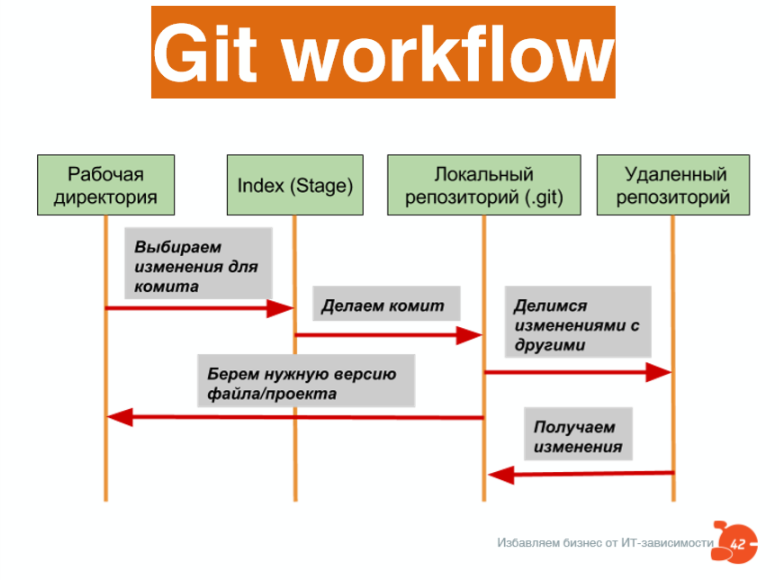
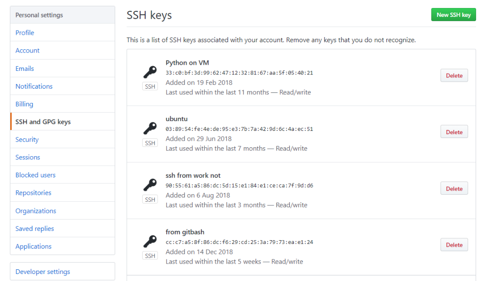

# git notes

# Про git

git -  это распределенная система контроля версий 

git в своих коммитах хранит полное состояние ветки. в отличии от svn, которая хранит diff 

система хранения git репозитория состоит из  4 объектов :

- blob
- tree
- commit
- tag

**blob -** базовая единица хранения данных.Хранит снепшот содержимого файла. В качестве имени объекта берется sha1 хэш содержимого файла и заголовка

**tree -** деревья содержат информацию о блобах, а также других поддеревьях.

# Git Workflow



# Установка и настройка

установка на ubuntu like системах

    $ sudo apt install git   

конфиг для взаимодействия с github

    $ git config --global user.name "username"
    $ git config --global user.email "username.user@example.com"

оценить конфиг

    $ git config --list

# $shell надстройки

настройка bash на отображение ветки и статуса индекса

    cd ~
    git clone https://github.com/magicmonty/bash-git-prompt.git .bash-git-prompt --depth=1

затем, в конец .bashrc добавить строки 

    GIT_PROMPT_ONLY_IN_REPO=1
    source ~/.bash-git-prompt/gitprompt.sh

для применения изменений перезапустить bash

    exec bash

# Работа с локальным репозиторием

создание репозитория  производится командой init в папке назначения

    git init

теперь git отслеживает все изменения файлов  папке. чтобы не отслеживать мусорные файлу, нужно их занести в .gitignore

    echo "*.trash" >> .gitignore

поработали,изменили файлики, заносим в индекс измененные  файлы

    git add *.changed_files

решили сделать коммит

    git commit -m "Change some files"

флаг -m и сообщение после - обязательные атрибуты коммита.

поработали еще, заносим измененные файлики в индекс (git add), ибо непроиндексированные изменения в коммит не уйдут.

команды для просмотра информации о состоянии репозитория

    git diff

    git log

    git status

# Аутентификация на github

Для аутентификации на github по ssh ключам  генерим ключи с аккаунтом github

    $ ssh-keygen -t rsa -b 4096 -C "github_email@gmail.com"

запускаем ssh-агента

    $ eval "$(ssh-agent -s)"

добавим ключ в ssh-агент

    $ ssh-add ~/.ssh/id_rsa

публичную часть ключа копируем s

    $ cat ~/.ssh/id_rsa.pub

и вносим на github в настройки профиля ssh ans gpg key



проверяем , что получилось

    $ ssh -T git@github.com
    Hi username! You've successfully authenticated, but GitHub does not provide shell access.

# Работа с удаленным репозиторием

Изначально, клонируем репозиторий с github

    git clone link_to_repo_on_github.git


для подтягивания актуальной версии 

    git pull

для отправки своих изменений на github

    git push origin master


# Rebase
 
 В Git существует два различных способа слияния веток. Один из них мы уже изучили - merge. Но есть еще и второй - rebase. Главное отличие состоит в том, что merge создает коммит с двумя предками - коммитами, из которых он образован. rebase же переносит (именно переносит) все коммиты из одной ветки в другую - как будто вы их делали в исходной ветке.

Чаще всего rebase применяется для создания линейной истории. Линейную историю читать проще, чем историю с большим количеством слияний.

```
git rebase master
```

# git squash - объединение коммитов

Чтобы избавиться от мусорных коммитов их можно слить с помощью squash 

Для объединения коммитов с init коммитом потребовался ключ --root
```
git rebase --root -i HEAD~8
```
Далее засквошить все коммиты

```
pick 9090
s 909023
s 900234
s 909843
s 808043
```

И отправиь в свой репозиторий "насильно")
```
git push sqr --force
```